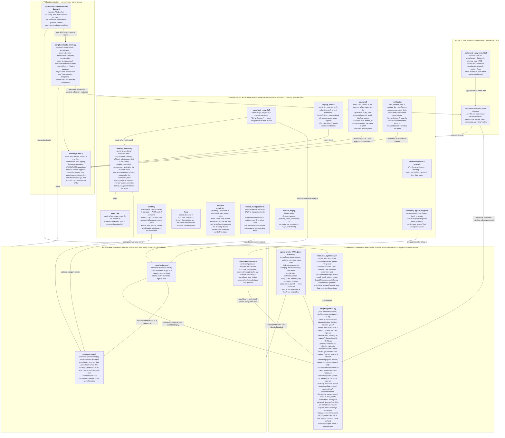

# Data Infrastructure & Schema Architecture

Current state of what's actually built (dataset layer + validation pipeline + optimization engine — the spend-entry UI and site are planned but not built, so they don't appear here).

> **Maintenance rule:** this diagram must be updated in the same change as any edit to `data/schema/card.schema.json`, the `data/meta/` registries, `scripts/validate_cards.py`, `scripts/optimize.py`, `.github/workflows/validate-data.yml`, or the repo's data layout. See `CLAUDE.md`.

## Reading the diagram

**Data flow in one sentence:** humans hand-write one YAML file per card conforming to the schema's blocks, every cross-card assumption (categories, merchants, point values) lives once in the `meta/` registries and is referenced by key, a validator — run by CI on every data change plus weekly — enforces structure as errors and freshness as warnings, and a deterministic optimizer scores every subset of eligible cards against a user's registry-keyed spend profile to rank portfolios.

**Why the optimizer is a pure function:** `scripts/optimize.py` takes only the dataset, a spend profile, its module-level policy-constants block, and an `--as-of` date — no network, no randomness, no hidden time inputs — so identical inputs produce byte-identical output, every recommendation is reproducible, and every judgment call (credit-capture haircuts, portal discount, rotating overlap) is echoed into the output where the user can see it. Data-quality problems (`confidence: low`, stale verification, expired bonuses) become per-card warnings in the results rather than silent exclusions, because excluding unverified cards would empty the product today.

**Why the blocks are separate:** each block is a different *kind of value* requiring different math — spend-proportional rates (with caps), fixed periodic credits, a one-time bonus, recurring fees. Flattening them into one rate table or prose is exactly what makes card comparisons unreliable everywhere else. The uniform shape means no card ever needs special-case handling.

**Why registries are separate files:** if every card embedded its own category names or point valuations, two cards could silently disagree ("grocery" vs "groceries"; 1.8cpp vs 2.1cpp for the same points). Keys are validated against the registries, so disagreement is a CI failure, and a valuation change is one edit that repriced every card at once.

**Why errors vs warnings:** structural problems (wrong field, unknown key, id/filename mismatch) mean the data can't be trusted at all — they fail CI. Freshness problems (6-month staleness, `confidence: low`, expired signup promo) mean the data needs a human re-check — they warn without blocking, and the weekly cron guarantees they keep surfacing until fixed.

## Resulting invariants

1. Every card file parses, conforms to the schema, and rejects unknown fields (typos can't hide).
2. `id` matches the filename, `issuer` matches the directory, ids are globally unique.
3. Every category / merchant / points-program key used anywhere resolves to a registry entry.
4. Cash cards always use `program: cash`; points values come only from the shared valuation table.
5. Every card carries a `sources` list pasting the exact URLs its facts came from, each declaring which blocks it supports — populated blocks with no supporting source are flagged.
6. Every card states who verified it, when, at what confidence — and CI re-surfaces anything stale, unverified, unsourced, or past its offer expiry, weekly, forever.
7. Optimizer runs are byte-reproducible: same dataset + profile + `--as-of` ⇒ identical output, with every policy assumption echoed in the run header.
8. In every scored portfolio each dollar of profile spend is assigned to exactly one reward line (closed-loop-only portfolios report unassignable spend as $0, never silently); credits can never exceed the user's real spend in their category; no card is recommended above the user's stated credit tier.
